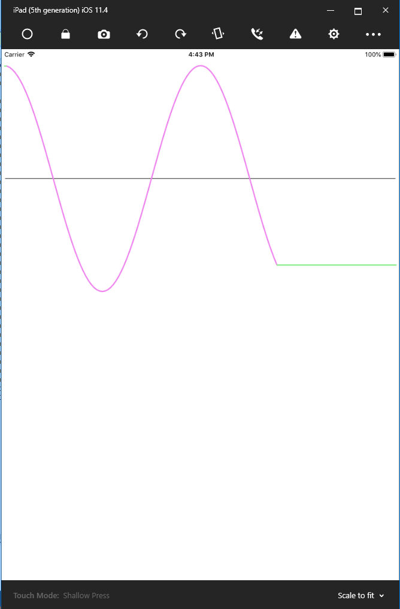

# MicrochartsSinusGraph
Example to show measured data (DateTime/Value pairs) in a Graph using Microcharts and SkiaSharp.(Xamarin.Forms Application).

The example is used to show measured data, esp. data gathered in the period of one day, in a LineChart (Example see: Sinuscurve.png).
The measured data have to be in the form of a chronologically sorted List of Measurements which consist of the SampleTime in Format DateTime and the measured Value in Format float.
The measured values are shown linear interpolated in a graph showing the period of one day (1440 minutes).
# Gallery
 

  

